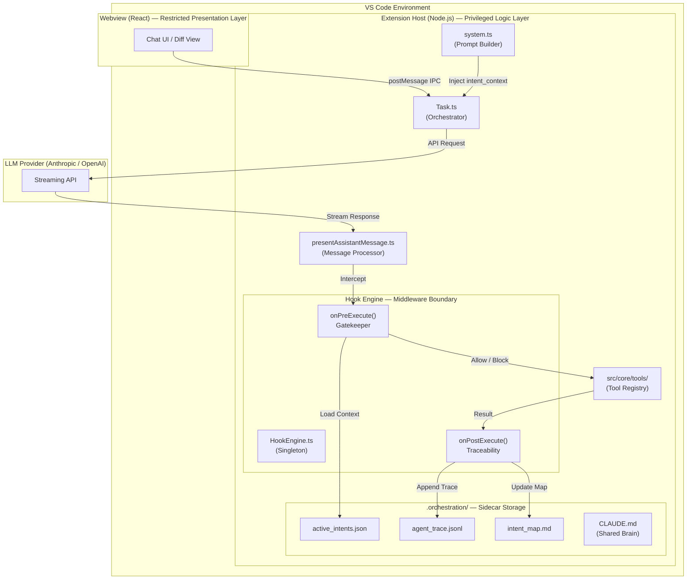
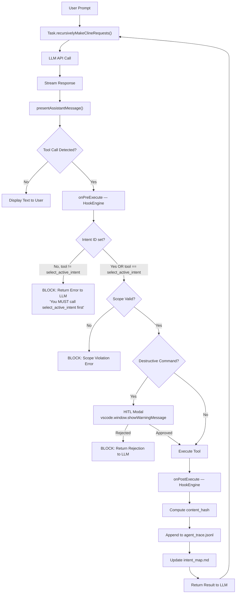
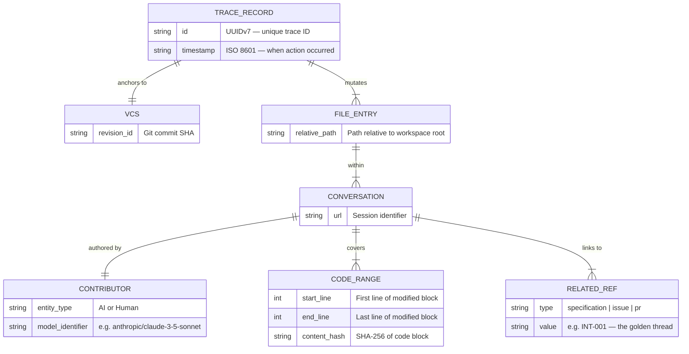

# Architecture Notes: AI-Native IDE Handshake & Intent-Code Traceability

## Executive Summary

This document provides a comprehensive architectural analysis of the Roo Code extension transformation into a governed AI-Native IDE. The implementation follows the **Master Thinker Philosophy**, establishing deterministic lifecycle hooks, intent-driven development, and cryptographic traceability to bridge the gap between business requirements and generated code.

---

## System Architecture Overview



---

## 1. Archaeological Findings (Phase 0)

### 1.1 Core Execution Loop

**Primary Discovery:** The agent execution follows a recursive request-response pattern orchestrated by `Task.ts`.

**Key Components Mapped:**

| Component             | Location                                                | Responsibility                                                                                      |
| --------------------- | ------------------------------------------------------- | --------------------------------------------------------------------------------------------------- |
| **Task Orchestrator** | `src/core/task/Task.ts`                                 | Main event loop; manages conversation state, API streaming, and tool execution coordination         |
| **Message Processor** | `src/core/assistant-message/presentAssistantMessage.ts` | Sequential content block processing; handles text display and tool execution with locking mechanism |
| **Prompt Builder**    | `src/core/prompts/system.ts`                            | Dynamic system prompt generation with mode-specific instructions and tool catalogs                  |
| **Tool Registry**     | `src/core/tools/`                                       | Individual tool implementations (write_to_file, execute_command, etc.)                              |
| **Tool Validator**    | `src/core/tools/validateToolUse.ts`                     | Schema validation for tool parameters                                                               |

### 1.2 Critical Architectural Patterns Identified

**1.2.1 Streaming Architecture**

- The system uses `presentAssistantMessageLocked` to prevent concurrent execution
- Content blocks arrive incrementally via `assistantMessageContent` array
- `currentStreamingContentIndex` tracks processing position
- `didCompleteReadingStream` signals completion

**1.2.2 Tool Execution Flow**

```
User Input → Task.recursivelyMakeClineRequests()
  → API Call (Anthropic/OpenAI)
  → Stream Response
  → presentAssistantMessage()
  → Tool Validation
  → Tool Execution
  → Result Formatting
  → Next Request
```

**1.2.3 Extension Architecture**

- **Extension Host (Node.js):** Handles all business logic, API calls, file system operations
- **Webview (React):** Presentation layer only; communicates via `postMessage` IPC
- **Strict Privilege Separation:** No Node.js APIs accessible from Webview

### 1.3 Existing Infrastructure Leveraged

**MCP Integration:**

- `McpHub` (`src/services/mcp/McpHub.ts`) manages Model Context Protocol servers
- Dynamic tool discovery via `client.listTools()`
- Tools injected into system prompt as JSON Schema definitions

**State Management:**

- Task persistence in `.roo/` directory
- Checkpoint system for file modifications
- Terminal process registry for command execution

**Mode System:**

- Multiple operational modes (Architect, Code, Debug)
- Mode-specific prompt components and tool restrictions
- Dynamic mode switching via `switch_mode` tool

---

## 2. The Interceptor Pattern: Hook Engine Architecture

### 2.1 Design Philosophy

The Hook Engine implements a **Middleware/Interceptor Pattern** that wraps all tool execution requests. Unlike system prompts (probabilistic adherence), hooks are **hardcoded, event-driven middleware** that execute deterministically.

### 2.2 Hook Engine Implementation (`src/hooks/HookEngine.ts`)

**Singleton Pattern:**

```typescript
export class HookEngine {
	private static instance: HookEngine
	public static getInstance(): HookEngine
}
```

**Core Methods:**

| Method                                        | Phase     | Purpose                                                                 |
| --------------------------------------------- | --------- | ----------------------------------------------------------------------- |
| `onPreExecute(context)`                       | Pre-Hook  | Gatekeeper; enforces intent checkout, scope validation, risk assessment |
| `onPostExecute(context, result)`              | Post-Hook | Traceability; logs mutations, updates state, triggers formatters        |
| `checkScope(cwd, intentId, toolName, params)` | Pre-Hook  | Validates file paths against intent's `owned_scope`                     |
| `assessRisk(toolName, params)`                | Pre-Hook  | Classifies commands as "safe" or "destructive"                          |
| `askForHITLApproval(toolName, params)`        | Pre-Hook  | UI-blocking modal for destructive actions                               |

### 2.3 The Handshake Protocol (Two-Stage State Machine)

**Problem Solved:** Context Paradox - How to inject intent context before the agent analyzes the user's request?

**Solution:** Mandatory tool call sequence:



**Enforcement Mechanism:**

```typescript
if (!intentId && toolName !== "select_active_intent") {
	return {
		allow: false,
		reason: "You MUST call select_active_intent first",
	}
}
```

### 2.4 Scope Enforcement Algorithm

**Input:** `intentId`, `toolName`, `params`
**Output:** `{ allow: boolean, reason?: string }`

**Logic:**

1. Load `.orchestration/active_intents.json`
2. Find intent by ID
3. Extract `owned_scope` array (glob patterns)
4. Resolve target path from tool params
5. Match against patterns using `path.startsWith()`
6. Block if no match found

**Example Scope Definition:**

```json
{
	"id": "INT-001",
	"scope": ["src/auth/**", "src/middleware/jwt.ts"]
}
```

### 2.5 Risk Assessment Heuristics

**Destructive Tool Detection:**

- Tools: `execute_command`, `write_to_file`, `apply_diff`, `edit_file`, `apply_patch`
- Command Regex: `/\b(rm|chmod|sudo)\b.*(-f|--force|\/dev\/)/i`
- Triggers: HITL modal via `vscode.window.showWarningMessage`

**Safe Tools:**

- `read_file`, `list_files`, `search_files`, `ask_followup_question`

---

## 3. Context Engineering: Intent Injection System

### 3.1 System Prompt Modification

**Location:** `src/core/prompts/system.ts`

**New Function Added:**

```typescript
async function getIntentContextSection(cwd: string, activeIntentId?: string): Promise<string>
```

**Injection Point:**

```typescript
const [modesSection, skillsSection, intentSection] = await Promise.all([
	getModesSection(context),
	getSkillsSection(skillsManager, mode as string),
	getIntentContextSection(cwd, activeIntentId), // NEW
])
```

### 3.2 Intent Context Structure

**XML Format (for LLM parsing):**

```xml
<intent_context>
  <active_intent id="INT-001">
    <name>JWT Authentication Migration</name>
    <status>IN_PROGRESS</status>
    <scope>
      <pattern>src/auth/**</pattern>
      <pattern>src/middleware/jwt.ts</pattern>
    </scope>
    <constraints>
      <constraint>Must not use external auth providers</constraint>
      <constraint>Must maintain backward compatibility</constraint>
    </constraints>
    <acceptance_criteria>
      <criterion>Unit tests in tests/auth/ pass</criterion>
    </acceptance_criteria>
  </active_intent>
</intent_context>
```

### 3.3 Dynamic Context Loading

**Process:**

1. `select_active_intent` tool called with `intent_id`
2. Pre-Hook reads `.orchestration/active_intents.json`
3. Extracts relevant intent data
4. Formats as XML
5. Returns as tool result
6. LLM receives context in next message

---

## 4. Data Model: The Orchestration Layer

### 4.1 Directory Structure

```
.orchestration/
├── active_intents.json      # Intent specifications
├── agent_trace.jsonl        # Append-only trace ledger
├── intent_map.md            # Spatial mapping (Intent → Files)
└── .intentignore            # Global exclusion rules
```

### 4.2 active_intents.json Schema

```json
{
	"intents": [
		{
			"id": "INT-001",
			"name": "JWT Authentication Migration",
			"status": "IN_PROGRESS",
			"scope": ["src/auth/**", "src/middleware/jwt.ts"],
			"constraints": [
				"Must not use external auth providers",
				"Must maintain backward compatibility with Basic Auth"
			],
			"acceptance_criteria": ["Unit tests in tests/auth/ pass", "No breaking changes to existing API"],
			"created_at": "2026-02-16T10:00:00Z",
			"updated_at": "2026-02-16T12:30:00Z"
		}
	]
}
```

### 4.3 agent_trace.jsonl Schema (Agent Trace Spec)

**Per-Line JSON Object:**

```json
{
	"id": "550e8400-e29b-41d4-a716-446655440000",
	"timestamp": "2026-02-16T12:00:00Z",
	"vcs": { "revision_id": "abc123def456" },
	"files": [
		{
			"relative_path": "src/auth/middleware.ts",
			"conversations": [
				{
					"url": "session_2026-02-16_12-00",
					"contributor": {
						"entity_type": "AI",
						"model_identifier": "anthropic/claude-3-5-sonnet-20241022"
					},
					"ranges": [
						{
							"start_line": 15,
							"end_line": 45,
							"content_hash": "sha256:a8f5f167f44f4964e6c998dee827110c"
						}
					],
					"related": [
						{
							"type": "specification",
							"value": "INT-001"
						}
					]
				}
			]
		}
	]
}
```

**Schema Diagram:**



**Key Properties:**

- **content_hash:** SHA-256 of code block for spatial independence
- **related.value:** Links to intent ID (the "golden thread")
- **vcs.revision_id:** Git commit SHA for temporal anchoring

### 4.4 intent_map.md Structure

```markdown
# Intent-to-Code Spatial Map

## INT-001: JWT Authentication Migration

- **Files Modified:**
    - `src/auth/middleware.ts` (lines 15-45)
    - `src/auth/jwt-validator.ts` (lines 10-30)
- **AST Nodes:**
    - Function: `authenticateUser`
    - Class: `JWTValidator`
- **Last Updated:** 2026-02-16T12:30:00Z
```

---

## 5. Tool Implementation: select_active_intent

### 5.1 Tool Definition

**Location:** `src/core/tools/SelectActiveIntentTool.ts`

**Schema:**

```typescript
{
  name: "select_active_intent",
  description: "Checkout an active intent to link your actions to business goals",
  input_schema: {
    type: "object",
    properties: {
      intent_id: {
        type: "string",
        description: "The ID of the intent (e.g., INT-001)"
      }
    },
    required: ["intent_id"]
  }
}
```

### 5.2 Execution Flow

```typescript
export async function selectActiveIntentTool(cwd: string, intentId: string): Promise<ToolResponse> {
	// 1. Load active_intents.json
	const intentsFile = path.join(cwd, ".orchestration", "active_intents.json")
	const data = JSON.parse(await fs.readFile(intentsFile, "utf-8"))

	// 2. Find intent
	const intent = data.intents.find((i) => i.id === intentId)
	if (!intent) {
		return formatResponse.toolError(`Intent ${intentId} not found`)
	}

	// 3. Format context
	const contextXml = `
<intent_context>
  <active_intent id="${intent.id}">
    <name>${intent.name}</name>
    <scope>${intent.scope.map((s) => `<pattern>${s}</pattern>`).join("")}</scope>
    <constraints>${intent.constraints.map((c) => `<constraint>${c}</constraint>`).join("")}</constraints>
  </active_intent>
</intent_context>`

	// 4. Store in task state
	task.activeIntentId = intentId

	// 5. Return context to LLM
	return formatResponse.toolResult(contextXml)
}
```

---

## 6. Integration Points

### 6.1 Modifications to presentAssistantMessage.ts

**Before Tool Execution:**

```typescript
// NEW: Hook interception
const hookEngine = HookEngine.getInstance()
const hookResponse = await hookEngine.onPreExecute({
  task: cline,
  toolName: toolUse.name,
  params: toolUse.input,
  intentId: cline.activeIntentId
})

if (!hookResponse.allow) {
  // Block execution, return error to LLM
  return formatResponse.toolError(hookResponse.reason)
}

// EXISTING: Proceed with tool execution
const result = await executeTool(toolUse)

// NEW: Post-hook
await hookEngine.onPostExecute({...}, result)
```

### 6.2 Task State Extension

**New Properties in Task.ts:**

```typescript
export class Task {
	// Existing properties...

	// NEW: Intent tracking
	public activeIntentId?: string
	public intentHistory: string[] = []

	// NEW: Trace metadata
	public sessionId: string = uuidv7()
	public traceRecords: TraceRecord[] = []
}
```

---

## 7. Phase 3 Roadmap: Full Traceability

### 7.1 Content Hashing Implementation

**Utility Function:**

```typescript
import crypto from "crypto"

export function computeContentHash(content: string): string {
	return crypto.createHash("sha256").update(content).digest("hex")
}
```

### 7.2 Post-Hook Trace Logging

```typescript
public async onPostExecute(context: HookContext, result: any): Promise<void> {
  if (context.toolName === "write_to_file") {
    const { path: filePath, content } = context.params
    const contentHash = computeContentHash(content)

    const traceRecord = {
      id: uuidv7(),
      timestamp: new Date().toISOString(),
      vcs: { revision_id: await getGitCommitSHA(context.task.cwd) },
      files: [{
        relative_path: filePath,
        conversations: [{
          url: context.task.sessionId,
          contributor: {
            entity_type: "AI",
            model_identifier: context.task.api.getModel().id
          },
          ranges: [{
            start_line: 1, // TODO: Calculate from diff
            end_line: content.split('\n').length,
            content_hash: `sha256:${contentHash}`
          }],
          related: [{
            type: "specification",
            value: context.intentId
          }]
        }]
      }]
    }

    await appendToTraceLog(context.task.cwd, traceRecord)
  }
}
```

### 7.3 Semantic Classification (AST Proofs)

**Detection Logic (src/utils/ast.ts):**
To distinguish between feature addition and pure refactoring, we use structural hashing:

1.  **Parse**: Convert code to AST using TypeScript parser.
2.  **Strip**: Remove identifiers, literals, and comments.
3.  **Hash**: Create a SHA-256 signature of the remaining SyntaxKind sequence.

```typescript
export function generateStructuralHash(code: string): string {
	const sourceFile = ts.createSourceFile("temp.ts", code, ts.ScriptTarget.Latest, true)
	const kinds: number[] = []
	function visit(node: ts.Node) {
		kinds.push(node.kind)
		ts.forEachChild(node, visit)
	}
	visit(sourceFile)
	return crypto.createHash("sha256").update(kinds.join(",")).digest("hex")
}
```

**Mutation Types:**

- `AST_REFACTOR`: Pre-mutation Hash == Post-mutation Hash. The "logic" is identical; only names/formatting changed.
- `EVOLUTION`: Structural hashes differ. Intent has evolved or logic has changed.

---

## 8. Orchestration: Hierarchical Supervision

### 8.1 Manager-Worker Pattern (Hierarchical Supervision)

**Pattern**: Direct delegation of sub-tasks via nested intents.

1.  **Architect/Manager**: Receives high-level user request.
2.  **Delegation**: Calls `spawn_sub_intent` to create granular child intents with unique scopes and constraints.
3.  **Worker execution**: Sequential or parallel workers execute sub-intents.
4.  **Verification**: Manager verifies sub-task completion against acceptance criteria.

### 8.2 SpawnSubIntentTool (`src/core/tools/SpawnSubIntentTool.ts`)

Allows agents to programmatically extend the intent ledger:

```typescript
// input params
{
  id: "INT-001-A",
  description: "Implement JWT validation logic",
  parent_id: "INT-001",
  scope: ["src/auth/jwt-validator.ts"]
}
```

### 8.3 Shared Brain (CLAUDE.md)

**Purpose:** Cross-session knowledge persistence

**Update Triggers:**

- Linter failures
- Test failures
- Architectural decisions
- Scope violations

**Example Entry:**

```markdown
## Lesson: 2026-02-16T12:45:00Z

**Context:** INT-001 (JWT Migration)
**Issue:** Attempted to modify `src/config/database.ts` outside scope
**Resolution:** Scope expanded to include database config
**Takeaway:** Auth changes require database schema updates
```

---

## 9. Security & Enterprise Guardrails

### 9.1 .intentignore Implementation

**Format:** Gitignore-style patterns

```
# Sensitive files
.env
.env.*
secrets/
*.key
*.pem

# System files
/etc/**
/boot/**
```

**Enforcement:**

```typescript
private async checkIntentIgnore(
  cwd: string,
  targetPath: string
): Promise<boolean> {
  const ignoreFile = path.join(cwd, ".orchestration", ".intentignore")
  const patterns = await fs.readFile(ignoreFile, "utf-8")

  return patterns.split('\n')
    .filter(line => !line.startsWith('#'))
    .some(pattern => minimatch(targetPath, pattern))
}
```

### 9.2 Context Rot Mitigation (Active Context Compaction)

**Hook Mechanism**: Hard enforcement of history management.

- **Trigger**: `task.clineMessages.length > 40`
- **Action**: Blocking Pre-Hook response.
- **Protocol**: Forces the agent to summarize state into `CLAUDE.md`, providing a "Checkpointed Brain" before resetting the session. This prevents hallucination and context decay.

```typescript
if (task.clineMessages.length > 40) {
	return {
		allow: false,
		reason: "> [!STOP]\n> **Context Rot Mitigation.** ... Required Action: Summarize progress and restart.",
	}
}
```

### 9.3 Circuit Breaker

**Infinite Loop Detection:**

```typescript
if (task.consecutiveToolFailures > 5) {
	await vscode.window.showErrorMessage("Agent entered infinite loop. Halting execution.")
	task.abort = true
}
```

---

## 10. References & Prior Art

- **Agent Trace Spec:** https://agent-trace.dev/
- **GitHub SpecKit:** https://github.com/github/spec-kit
- **Claude Code Hooks:** https://code.claude.com/docs/en/hooks
- **Roo Code Repository:** https://github.com/RooCodeInc/Roo-Code
- **MCP Specification:** https://modelcontextprotocol.io/

---

## Appendix A: File Modification Log

| File                                                    | Type     | Purpose                                            |
| ------------------------------------------------------- | -------- | -------------------------------------------------- |
| `src/hooks/HookEngine.ts`                               | MODIFIED | Integrated AST proofs & Context Compaction trigger |
| `src/core/tools/SelectActiveIntentTool.ts`              | NEW      | Intent checkout tool                               |
| `src/core/tools/SpawnSubIntentTool.ts`                  | NEW      | Hierarchical delegation tool                       |
| `src/core/prompts/sections/intent-context.ts`           | NEW      | Context injection                                  |
| `src/core/prompts/system.ts`                            | MODIFIED | Added getIntentContextSection()                    |
| `src/core/assistant-message/presentAssistantMessage.ts` | MODIFIED | Hook interception & Tool execution registry        |
| `src/core/task/Task.ts`                                 | MODIFIED | Added activeIntentId property                      |
| `src/utils/ast.ts`                                      | NEW      | Structural hashing logic for semantic proofs       |
| `.orchestration/active_intents.json`                    | NEW      | Intent specifications                              |
| `.orchestration/agent_trace.jsonl`                      | NEW      | Trace ledger                                       |

---

---

**Document Version:** 1.2  
**Last Updated:** 2026-02-18
