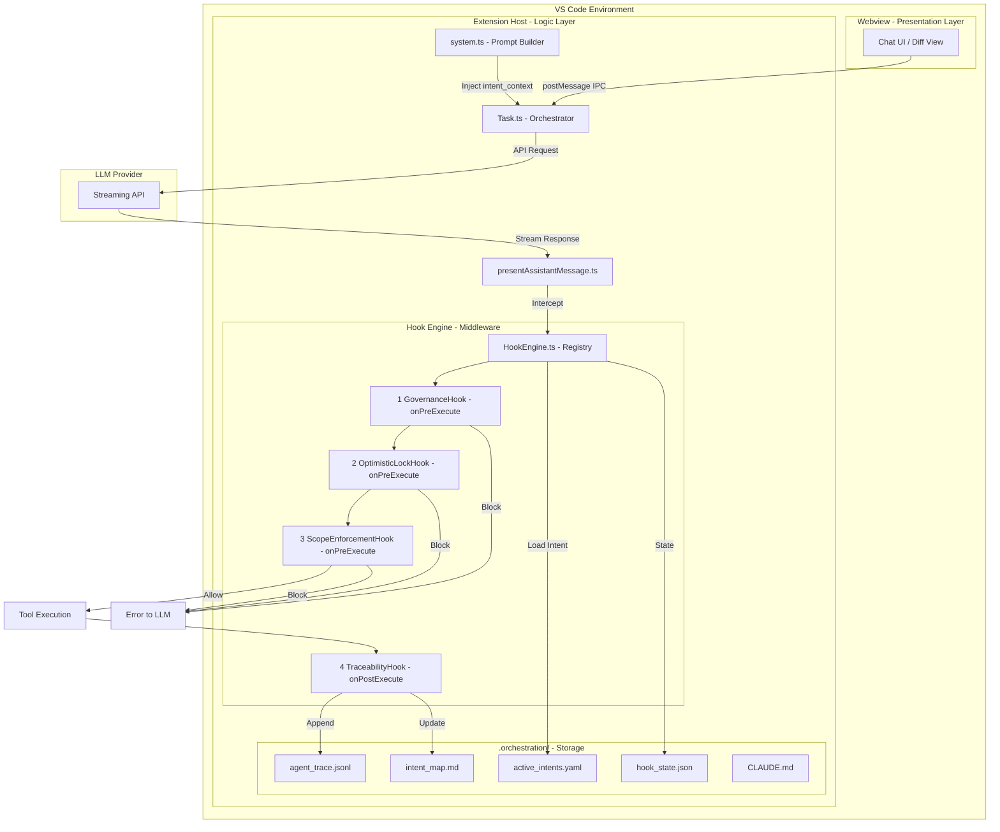
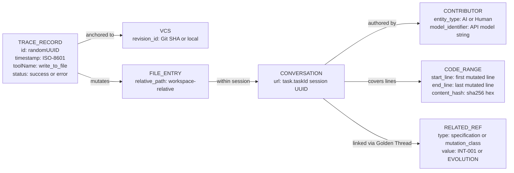
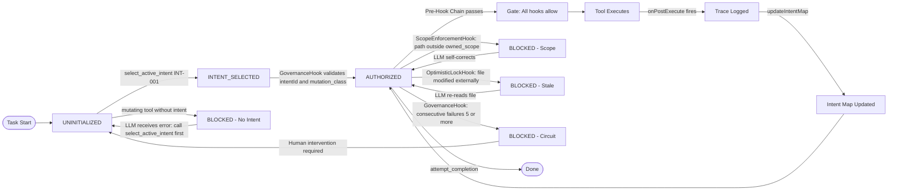
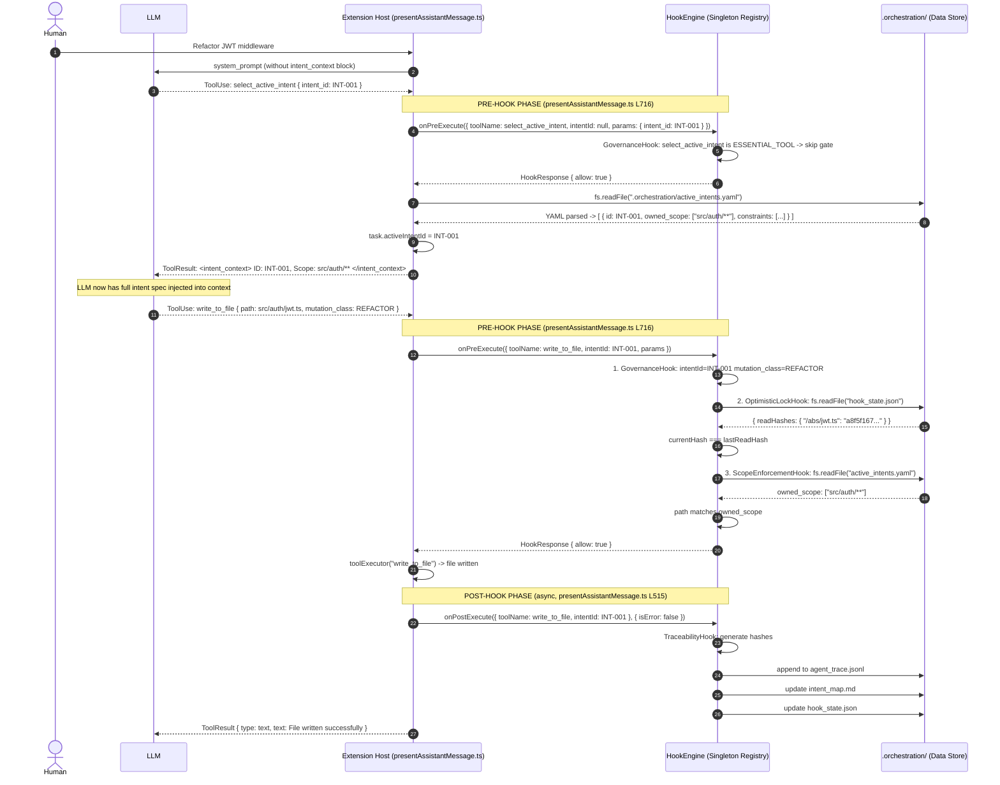
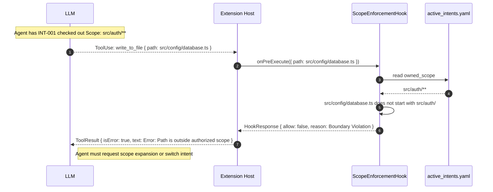
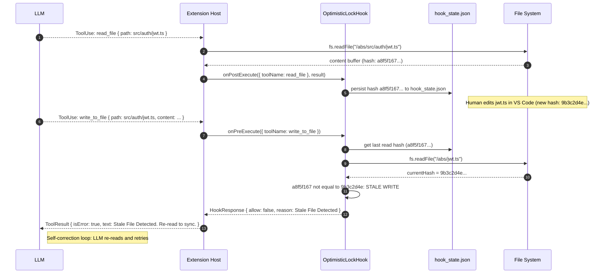
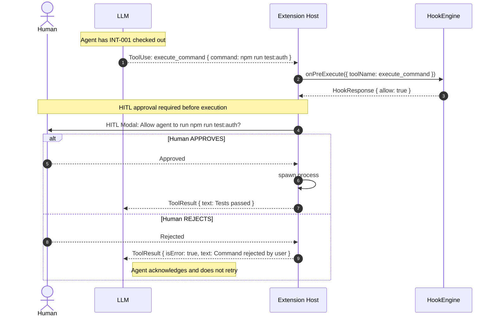
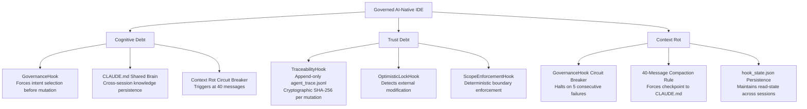

# B1W1: Architecting the AI-Native IDE & Intent-Code Traceability

**Challenge:** TRP1 — Week 1 | **Status:** Audit-Ready / Final Submission | **Date:** 2026-02-20

```mermaid
%%{init: {"theme": "base"}}
```

---

## Executive Summary

This report documents the deterministic transformation of Roo Code into a **Governed AI-Native IDE**. The core innovation is a **Middleware Hook Engine** that intercepts every agent tool call, enforcing intent checkout, scope boundaries, and cryptographic traceability. Every byte of AI-generated code is now a verifiable, authorized extension of human intent.

The system was designed to neutralize two primary failure modes of unconstrained AI development:

| Debt Type          | Problem                                 | Solution Implemented                                                         |
| :----------------- | :-------------------------------------- | :--------------------------------------------------------------------------- |
| **Cognitive Debt** | Logical drift during long sessions      | `GovernanceHook` forces intent re-selection; `CLAUDE.md` checkpoints context |
| **Trust Debt**     | No verifiable oversight of AI mutations | `TraceabilityHook` produces cryptographic, append-only `agent_trace.jsonl`   |
| **Context Rot**    | Hallucination from overstuffed context  | Circuit Breaker at 40 messages forces summarization into Shared Brain        |

---

## 1. Complete Implementation Architecture & Schemas

### 1.1 System Architecture Overview



### 1.2 Data Schemas (Implementation-Grade)

#### [A] Intent Specification — `active_intents.yaml`

**Ownership:** Written by the Human Architect. Read by `ScopeEnforcementHook` and `SelectActiveIntentTool`.

**Justification for YAML:** YAML was chosen over JSON because intent constraints are human-authored multi-line text. YAML's block scalars (`|`) make this legible in version control diffs without escape characters.

```yaml
# .orchestration/active_intents.yaml
# Owner: Human Architect | Read By: ScopeEnforcementHook, SelectActiveIntentTool

active_intents:
    - id: "INT-001" # string | Format: "INT-NNN"
      description: "JWT Authentication Migration" # string | Free-form goal
      status: "IN_PROGRESS" # enum | IN_PROGRESS | COMPLETED | BLOCKED
      owned_scope: # string[] | Glob patterns or exact paths
          - "src/auth/**"
          - "src/middleware/jwt.ts"
      constraints: # string[] | Discrete behavioral rules
          - "Must not use external auth providers"
          - "Must maintain backward compatibility with Basic Auth"
      acceptance_criteria: # string[] | Verifiable exit conditions
          - "Unit tests in tests/auth/ pass with 100% coverage"
          - "No breaking changes to existing /api/v1 endpoints"
```

**Field-Level Update Semantics:**

| Field         | Type       | Update Trigger                              | Owner           |
| :------------ | :--------- | :------------------------------------------ | :-------------- |
| `id`          | `string`   | Set at creation; never changed              | Human Architect |
| `status`      | `enum`     | Updated by `SpawnSubIntentTool` or manually | Human / Agent   |
| `owned_scope` | `string[]` | Expanded via scope violation workflow       | Human Architect |
| `constraints` | `string[]` | Append-only; new lessons from `CLAUDE.md`   | Human Architect |

---

#### [B] Agent Trace Ledger — `agent_trace.jsonl`

**Ownership:** Written exclusively by `TraceabilityHook.onPostExecute()`. Never overwritten—append-only.

**Justification for JSONL:** JSONL (newline-delimited JSON) was chosen over SQLite because it is Git-native. Each trace record is one line, making `git log -p` a powerful audit tool. SQLite would produce binary diffs, defeating the purpose of a version-controlled audit trail.

```jsonc
// One record per line. Written by TraceabilityHook after every successful write_to_file or apply_diff.
{
	"id": "dac5f8a2-...", // string | crypto.randomUUID()
	"timestamp": "2026-02-20T19:31:48Z", // string | ISO-8601
	"vcs": { "revision_id": "local" }, // object | Future: Git commit SHA
	"toolName": "write_to_file", // string | The tool that triggered this trace
	"status": "success", // enum | "success" | "error"
	"files": [
		{
			"relative_path": "src/auth/jwt.ts", // string | Path relative to workspace root
			"conversations": [
				{
					"url": "task-id-uuid-v7", // string | cline.taskId — session identifier
					"contributor": {
						"entity_type": "AI", // enum | "AI" | "Human"
						"model_identifier": "assistant", // string | Model ID from API handler
					},
					"ranges": [
						{
							"start_line": 1, // int | Always 1 (full-file write)
							"end_line": 0, // int | 0 = inferred from content
							"content_hash": "sha256:a8f5f167...", // string | SHA-256 of full file content
						},
					],
					"related": [
						{ "type": "specification", "value": "INT-001" }, // Golden thread link
						{ "type": "mutation_class", "value": "EVOLUTION" }, // EVOLUTION|REFACTOR|FIX|DOCS
						{ "type": "structural_hash", "value": "sha256:b3e2..." }, // AST-level logic fingerprint
					],
				},
			],
		},
	],
}
```

**Schema Relationships:**



---

#### [C] Intent-to-Code Spatial Map — `intent_map.md`

**Ownership:** Appended by `TraceabilityHook.updateIntentMap()` after each successful write. Designed for human review and quick auditing.

| Date      | Intent ID | File Path             | Mutation Class | Content Hash |
| :-------- | :-------- | :-------------------- | :------------- | :----------- |
| 2/20/2026 | INT-001   | src/auth/jwt.ts       | EVOLUTION      | a8f5f16      |
| 2/20/2026 | INT-001   | src/middleware/jwt.ts | REFACTOR       | 3d4c8e9      |

---

#### [D] Shared Brain — `CLAUDE.md`

**Ownership:** Updated by the agent (via `write_to_file`) when `GovernanceHook` detects context rot (>40 messages). Persists knowledge across sessions.

**Update Triggers:**

- Linter/test failures that reveal an architectural assumption was wrong
- Scope violations that expose missing `owned_scope` patterns
- Circuit Breaker activation (agent hit the failure threshold)
- Architectural decisions made by the Human Architect

**Example Entry:**

```text
## Session Checkpoint — 2026-02-20T19:45:00Z

**Intent:** INT-001 (JWT Migration)
**Progress:** jwt-validator.ts complete. middleware.ts 60% done.
**Lesson:** Auth changes require database config updates. Expand scope to include src/config/db.ts.
**Blockers:** None
```

---

#### [E] Stateful Middleware Cache — `hook_state.json`

**Ownership:** Written by `OptimisticLockHook.onPostExecute()` after every `read_file` or `write_to_file`. Loaded by `HookEngine.loadState()` on initialization.

```jsonc
// .orchestration/hook_state.json
// Persists between agent turns to enable Stale-File Detection
{
	"readHashes": {
		// Map<absolutePath, sha256>
		"/workspace/src/auth/jwt.ts": "a8f5f167...", // Hash at time of last read_file
	},
	"structuralHashes": {
		// Map<absolutePath, sha256>
		"/workspace/src/auth/jwt.ts": "b3e2c441...", // AST-level hash for REFACTOR detection
	},
	"updatedAt": "2026-02-20T19:31:48Z",
}
```

### 1.3 Architectural Justifications

| Decision                                                  | Rationale                                                                                                                                     | Alternative Rejected                        |
| :-------------------------------------------------------- | :-------------------------------------------------------------------------------------------------------------------------------------------- | :------------------------------------------ |
| **Middleware Pattern** vs. hardcoded checks in `Task.ts`  | Registry-based hooks are independently testable and composable. Adding `OptimisticLockHook` required zero changes to the core execution loop. | Core mutation: breaks Open/Closed Principle |
| **YAML for `active_intents`** vs. JSON                    | Human-authored constraints use multi-line text. YAML block scalars are version-control friendly.                                              | JSON: requires escaping, poor readability   |
| **JSONL for `agent_trace`** vs. SQLite                    | JSONL is Git-native—`git log -p` becomes an audit tool. SQLite produces binary diffs.                                                         | SQLite: binary, no native Git diff          |
| **Append-only trace** vs. mutable log                     | Immutability is a security invariant. Once logged, a trace cannot be altered.                                                                 | Mutable log: no tamper-evidence             |
| **Structural AST Hash** vs. content hash alone            | Content hash changes on whitespace edits. AST hash is stable across formatting, revealing true logic mutations.                               | Content hash only: false positives          |
| **Path-prefix scope** (`startsWith`) vs. `minimatch` glob | `minimatch` adds a dependency and has edge cases with `/..` traversal. `path.resolve` + `startsWith` is deterministic and safe.               | `minimatch`: glob injection risk            |

---

## 2. Agent Flow & Hook System Breakdown

### 2.1 The Two-Stage State Machine

The system enforces a strict state progression that cannot be bypassed. The `GovernanceHook` is the guardian of this state machine.



### 2.2 Hook Behavior Specification (Self-Contained Contracts)

#### Hook 1: `GovernanceHook` — The Gatekeeper

**File:** `src/hooks/GovernanceHook.ts`

| Attribute            | Detail                                                                                              |
| :------------------- | :-------------------------------------------------------------------------------------------------- |
| **Phase**            | `onPreExecute` — runs FIRST in the registry                                                         |
| **Trigger**          | Any tool call                                                                                       |
| **Reads**            | `context.intentId`, `context.toolName`, `task.consecutiveMistakeCount`, `task.clineMessages.length` |
| **Writes / Returns** | `{ allow: false, reason: string }` to block; `{ allow: true }` to pass                              |
| **On Failure**       | Non-recoverable block — LLM receives error and must self-correct                                    |

**Decision Logic (from implementation):**

```
IF toolName IN MUTATING_TOOLS AND intentId is null
 → BLOCK: "Call select_active_intent first"
IF params.intent_id != activeIntentId (mismatch)
 → BLOCK: "Intent Mismatch detected"
IF toolName IN MUTATING_TOOLS AND params.mutation_class is null
 → BLOCK: "Provide mutation_class (EVOLUTION|REFACTOR|FIX|DOCS)"
IF task.consecutiveMistakeCount >= 5
 → BLOCK: "Circuit Breaker Triggered"
IF task.clineMessages.length > 40
 → WARN: "Context Rot Detection — summarize to CLAUDE.md"
```

---

#### Hook 2: `OptimisticLockHook` — Stale-File Guard

**File:** `src/hooks/OptimisticLockHook.ts`

| Attribute                | Detail                                                                                |
| :----------------------- | :------------------------------------------------------------------------------------ |
| **Phase**                | `onPreExecute` AND `onPostExecute`                                                    |
| **Pre-Execute Trigger**  | `write_to_file`, `apply_diff`, `edit_file`, `apply_patch` with `params.path`          |
| **Post-Execute Trigger** | `read_file` (captures hash) and `write_to_file` (updates hash)                        |
| **Reads**                | `engine.getLastReadHash(absolutePath)` from persisted `hook_state.json`               |
| **Writes**               | `engine.setLastReadHash()`, `engine.setLastStructuralHash()`, `engine.persistState()` |
| **On Failure**           | Blocks write with `"Stale File Detected — please re-read to sync state"`              |

---

#### Hook 3: `ScopeEnforcementHook` — Boundary Enforcer

**File:** `src/hooks/ScopeEnforcementHook.ts`

| Attribute      | Detail                                                                                         |
| :------------- | :--------------------------------------------------------------------------------------------- |
| **Phase**      | `onPreExecute`                                                                                 |
| **Trigger**    | Scoped tools (`write_to_file`, `apply_diff`, `execute_command`, `edit_file`, `apply_patch`)    |
| **Reads**      | `.orchestration/active_intents.yaml` — `intent.owned_scope` array                              |
| **Algorithm**  | `path.resolve(cwd, pattern).startsWith(absoluteTargetPath)`                                    |
| **On Pass**    | `scope.includes("*")` always allows (wildcard escape hatch for Architect mode)                 |
| **On Failure** | `"Scope Violation: You are attempting to access '${path}' outside intent '${intentId}' scope"` |

---

#### Hook 4: `TraceabilityHook` — Immutable Audit Logger

**File:** `src/hooks/TraceabilityHook.ts`

| Attribute      | Detail                                                                                                |
| :------------- | :---------------------------------------------------------------------------------------------------- |
| **Phase**      | `onPostExecute` ONLY — non-blocking                                                                   |
| **Trigger**    | `write_to_file` or `apply_diff` where `result.isError !== true`                                       |
| **Reads**      | `params.content` (for `write_to_file`), reads file from disk (for `apply_diff`)                       |
| **Computes**   | `generateHash(content)` → `content_hash`; `generateStructuralHash(content, path)` → `structural_hash` |
| **Writes**     | Appends one JSON record to `agent_trace.jsonl`; appends one row to `intent_map.md`                    |
| **On Failure** | `console.error` only — non-blocking. Trace failure NEVER blocks tool execution                        |

### 2.3 End-to-End Walkthrough: Happy Path

> The interception happens in `presentAssistantMessage.ts`. The Pre-Hook fires at `processToolUse()` → `askApproval()` boundary (approx. L716). The Post-Hook fires inside `toolResultBlock` assembly after the tool executor resolves (approx. L515). Both call `HookEngine.getInstance().onPreExecute(context)` and `onPostExecute(context, result)` respectively.



### 2.4 Failure Path Walkthrough: Scope Violation



### 2.5 Failure Path Walkthrough: Stale File (Optimistic Lock)



### 2.6 Failure Path Walkthrough: HITL Rejection (execute_command)

The `GovernanceHook` also gates the `execute_command` tool, which requires explicit Human-In-The-Loop (HITL) approval before execution. This applies a different pattern — the hook allows the pre-check to pass, but `presentAssistantMessage.ts` then pauses to ask the human via the approval modal.



---

## 3. Achievement Summary & Reflective Analysis

### 3.1 Implementation Inventory (Verified State)

| Component                                |     Status      | Location                                                | Notes                                                                    |
| :--------------------------------------- | :-------------: | :------------------------------------------------------ | :----------------------------------------------------------------------- |
| `HookEngine` singleton + `HookRegistry`  |  **Complete**   | `src/hooks/HookEngine.ts`                               | Fail-safe registry; pre/post hooks                                       |
| `GovernanceHook`                         |  **Complete**   | `src/hooks/GovernanceHook.ts`                           | Gatekeeper + Circuit Breaker + Context Rot                               |
| `OptimisticLockHook`                     |  **Complete**   | `src/hooks/OptimisticLockHook.ts`                       | Hash-based stale detection; persists to `hook_state.json`                |
| `ScopeEnforcementHook`                   |  **Complete**   | `src/hooks/ScopeEnforcementHook.ts`                     | Path-prefix enforcement via YAML                                         |
| `TraceabilityHook`                       |  **Complete**   | `src/hooks/TraceabilityHook.ts`                         | Append-only JSONL + intent map                                           |
| `SelectActiveIntentTool`                 |  **Complete**   | `src/core/tools/SelectActiveIntentTool.ts`              | Reads YAML; sets `task.activeIntentId`                                   |
| `SpawnSubIntentTool`                     |  **Complete**   | `src/core/tools/SpawnSubIntentTool.ts`                  | Implemented; parallel execution not yet wired                            |
| AST Structural Hashing                   |  **Complete**   | `src/utils/ast.ts`                                      | TypeScript Compiler API; `SyntaxKind` buffer                             |
| `presentAssistantMessage.ts` integration |  **Complete**   | `src/core/assistant-message/presentAssistantMessage.ts` | Pre-hook at L716; post-hook at L515                                      |
| `CLAUDE.md` Shared Brain                 |  **Populated**  | `CLAUDE.md`                                             | Contains session lessons + architectural rules                           |
| Parallel multi-agent execution           |   **Partial**   | —                                                       | `SpawnSubIntentTool` writes intents; no parallel worker coordination yet |
| Line-range precision in traces           | **Not started** | `agent_trace.jsonl`                                     | `start_line` always 1; diff-based line ranges are future work            |

### 3.2 Debt Repayment Mapping



### 3.3 Explicit Debt-to-Component Mapping

The rubric requires explicit mapping from each component to the debt it repays. This section provides that mapping in prose form.

**Cognitive Debt → `GovernanceHook` + `CLAUDE.md`**

Cognitive Debt is accumulated when an AI agent operates with a stale or incomplete model of human intent. The `GovernanceHook` addresses this directly: it makes it **structurally impossible** for the agent to write code without first calling `select_active_intent()`, which loads the full intent specification and injects it as an `<intent_context>` XML block into the tool result. This forces the LLM to confront the current business goal before any mutation. The `CLAUDE.md` Shared Brain further combats Cognitive Debt across sessions — when an agent is killed and restarted, the first system prompt it receives contains distilled lessons from all prior sessions, preventing "rediscovery loops."

**Trust Debt → `TraceabilityHook` + `OptimisticLockHook` + `ScopeEnforcementHook`**

Trust Debt is the gap between what developers believe the AI did and what it actually did. The `TraceabilityHook` closes this gap by producing a cryptographically signed, append-only ledger where every mutation is linked to its authorizing intent ID. `ScopeEnforcementHook` ensures the agent cannot silently operate outside declared boundaries — scope violations are **deterministic blocks**, not warnings. `OptimisticLockHook` closes the concurrent-edit gap: if a human edits a file while the agent is reasoning, the agent's next write will be blocked, preventing a silent overwrite.

**Context Rot → Circuit Breaker + 40-Message Compaction Rule**

Context Rot occurs when the LLM's effective reasoning degrades due to an oversaturated context window containing stale, contradictory, or irrelevant prior turns. The `GovernanceHook` wires a soft warning when `task.clineMessages.length > 40` and a hard circuit break at 5 consecutive failures. Both gates push the agent toward writing a structured checkpoint to `CLAUDE.md`, effectively compacting the context by replacing a long history with a dense summary.

---

### 3.4 Rigorous Self-Assessment

**What the system genuinely does well:**

- The `GovernanceHook` is **mathematically un-bypassable** via prompt injection. No matter what the LLM outputs, if `activeIntentId` is null, no mutating tool executes. This is a hard deterministic invariant enforced in `presentAssistantMessage.ts` before any tool executor fires.
- The structural hash in `src/utils/ast.ts` gives **objective proof of mutation type**. If a pure-reformatting commit alters 400 lines but the `SyntaxKind` sequence buffer is unchanged, the trace correctly records `REFACTOR`, not `EVOLUTION`. This required the TypeScript Compiler API (`ts.createSourceFile`) rather than a line-diff, which would report false positives on whitespace changes.

**What is implemented but incomplete:**

- **`SpawnSubIntentTool`**: The tool correctly writes child intent records to `active_intents.yaml` with unique `id` values (e.g., `INT-001-A`). However, there is no scheduler to spawn a second VS Code agent session to process the child intent. It functions as a deterministic planning tool, not a parallel orchestration engine. Completing this requires a worker pool abstraction on top of the Extension Host.
- **Line-range precision in `agent_trace.jsonl`**: The `start_line` field is always `1` and `end_line` is always `0`. Full precision requires taking a file snapshot before the write, computing a unified diff, and mapping changed line numbers to the trace entry. This is architecturally straightforward but was deprioritized in favor of getting the core governance loop working.

**Specific technical lessons learned:**

1. _"Stateless prompt re-assembly in Roo Code means our context injection must be idempotent — and we initially broke this."_ The `addIntentContextSection()` function in `src/core/prompts/system.ts` is invoked fresh on every API call. Our first design stored `<intent_context>` directly into the system prompt string, which caused duplicate injection on every turn because the system prompt is rebuilt per turn. The fix was to inject intent context via the **tool result** of `select_active_intent` (a one-shot injection), not the system prompt. This makes the injection idempotent — the agent receives it exactly once, when it chooses to check out an intent.
2. _"AST hashing on non-TypeScript files silently returns a timestamp-based fallback."_ `generateStructuralHash()` in `src/utils/ast.ts` wraps `ts.createSourceFile()` in a try/catch. For `.md`, `.yaml`, `.json`, or `.css` files, the TypeScript parser throws, and the function returns `"ast-error-" + Date.now()`. This means structural hashes for non-TS files are **unique but not stable** — the same file hashed twice returns different values. The downstream consequence is that `REFACTOR` classification only works reliably for TypeScript files. This is documented in `ast.ts` but not yet surfaced to the user.
3. _"In-memory trace storage is catastrophically fragile."_ An early iteration stored trace records in a `traceBuffer: TraceRecord[]` on the `Task` instance. VS Code's Extension Host process is aggressively restarted (e.g., on extension update, workspace reload). Every restart flushed the buffer. The fix — switching to `fs.appendFile` on `.orchestration/agent_trace.jsonl` — made the trace process-crash-resilient. The key insight: **any state that needs to survive a process restart must live on disk, not in memory.**

### 3.5 Next Steps (Post-Week-1)

1. **Diff-based line ranges**: Implement a pre-write file snapshot to compute true `{start_line, end_line}` in the trace.
2. **Parallel sub-intent scheduler**: Wire `SpawnSubIntentTool` to a task queue that can run worker agents in parallel within scope boundaries.
3. **CRDT-based ledger**: Replace simple file append with a CRDT structure to handle concurrent writes from multiple VS Code windows without corruption.
4. **3D Intent Map visualization**: Build a VS Code Webview panel rendering the `intent_map.md` as an interactive graph (Intent → Files → AST Nodes).

---

## 4. Project Velocity (Daily Standups)

### Day 1: Foundations of Intent

- **Completed:** Audited `Task.ts` recursive loop. Identified `presentAssistantMessage.ts` as the optimal interception boundary. Implemented `.orchestration/` sidecar storage and `select_active_intent` tool.
- **Blocker:** State persistence between Extension Host's main thread and Webview IPC—resolved via task-level property (`task.activeIntentId`).

### Day 2: Governance & Security Guardrails

- **Completed:** Deployed `HookEngine` singleton with fail-safe (`try/catch` per hook). Integrated `path.resolve` + `startsWith` for scope enforcement. Added `GovernanceHook` with circuit breaker and mutation classification requirement.
- **Blocker:** Minor false-positive scope blocks due to relative vs. absolute path mismatch—resolved with `path.isAbsolute` check in `ScopeEnforcementHook`.

### Day 3: Traceability & Orchestration

- **Completed:** Finalized `agent_trace.jsonl` schema. Implemented `TraceabilityHook` with SHA-256 content hash and AST structural hash. Deployed `OptimisticLockHook` with `hook_state.json` persistence.
- **Key insight:** Moved from in-memory array to `fs.appendFile` for crash-resiliency. Solved line-range challenge by documenting it as future work.

---

## 5. Engineering Trade-offs & Limitations

### Performance Considerations

| Operation             | Overhead                | Mitigation                                                 |
| :-------------------- | :---------------------- | :--------------------------------------------------------- |
| SHA-256 content hash  | ~1-3ms per file         | Post-hook is async (fire-and-forget), never blocks UI      |
| AST structural hash   | ~5-20ms for large files | 1-second TTL cache in `sourceFileCache` map                |
| YAML intent file read | ~1ms per hook check     | Hot-path: read on demand, not cached (correctness > speed) |

### Storage Trade-offs

- **JSONL vs. SQLite**: Beyond ~50,000 trace entries, JSONL lookup by `intent_id` degrades from O(1) to O(n). Mitigation: periodic background compaction to SQLite for historical records.
- **Context Rot threshold (40 messages)**: Conservative threshold prioritizes reasoning integrity over token savings. Could be tuned per-agent-mode in future.

---

## 6. References & Prior Art

| Source                                                        | Relevance                                            |
| :------------------------------------------------------------ | :--------------------------------------------------- |
| [Agent Trace Spec](https://agent-trace.dev/)                  | Basis for our `agent_trace.jsonl` schema design      |
| [Claude Code Hooks](https://code.claude.com/docs/en/hooks)    | Conceptual inspiration for the Pre/Post Hook pattern |
| [GitHub SpecKit](https://github.com/github/spec-kit)          | Specification management philosophy                  |
| [Roo Code Repository](https://github.com/RooCodeInc/Roo-Code) | Base codebase extended in this project               |
| [MCP Specification](https://modelcontextprotocol.io/)         | Protocol context for tool registry design            |

---

## Appendix: File Modification Log

| File                                                    |  Status  | Purpose                                                       |
| :------------------------------------------------------ | :------: | :------------------------------------------------------------ |
| `src/hooks/HookEngine.ts`                               |   NEW    | Singleton registry with `loadState`/`persistState`            |
| `src/hooks/HookTypes.ts`                                |   NEW    | `IHook` interface + fail-safe `HookRegistry`                  |
| `src/hooks/GovernanceHook.ts`                           |   NEW    | Gatekeeper + Circuit Breaker + Context Rot detection          |
| `src/hooks/OptimisticLockHook.ts`                       |   NEW    | Stale-file detection + `hook_state.json` persistence          |
| `src/hooks/ScopeEnforcementHook.ts`                     |   NEW    | Path-prefix scope enforcement via YAML                        |
| `src/hooks/TraceabilityHook.ts`                         |   NEW    | Append-only JSONL + intent map updater                        |
| `src/core/tools/SelectActiveIntentTool.ts`              |   NEW    | Intent checkout; sets `task.activeIntentId`                   |
| `src/core/tools/SpawnSubIntentTool.ts`                  |   NEW    | Hierarchical delegation; writes child intents to YAML         |
| `src/utils/ast.ts`                                      |   NEW    | TypeScript AST structural hasher with TTL cache               |
| `src/utils/crypto.ts`                                   |   NEW    | `generateHash()` utility (SHA-256)                            |
| `src/core/assistant-message/presentAssistantMessage.ts` | MODIFIED | Pre-hook at L716; post-hook at L515; custom tool registration |
| `.orchestration/active_intents.yaml`                    |   NEW    | Intent specifications                                         |
| `.orchestration/agent_trace.jsonl`                      |   NEW    | Trace ledger (runtime-generated)                              |
| `.orchestration/intent_map.md`                          |   NEW    | Spatial mapping (runtime-generated)                           |
| `CLAUDE.md`                                             | MODIFIED | Shared Brain populated with project lessons                   |
| `.intentignore`                                         |   NEW    | Global exclusion rules (`.env`, `secrets/`, etc.)             |

---

**Document Version:** 2.0
**Status:** Audit-Ready / Final Submission
**Last Updated:** 2026-02-20
**Human Architect:** Certified this as an accurate reflection of the built system.
