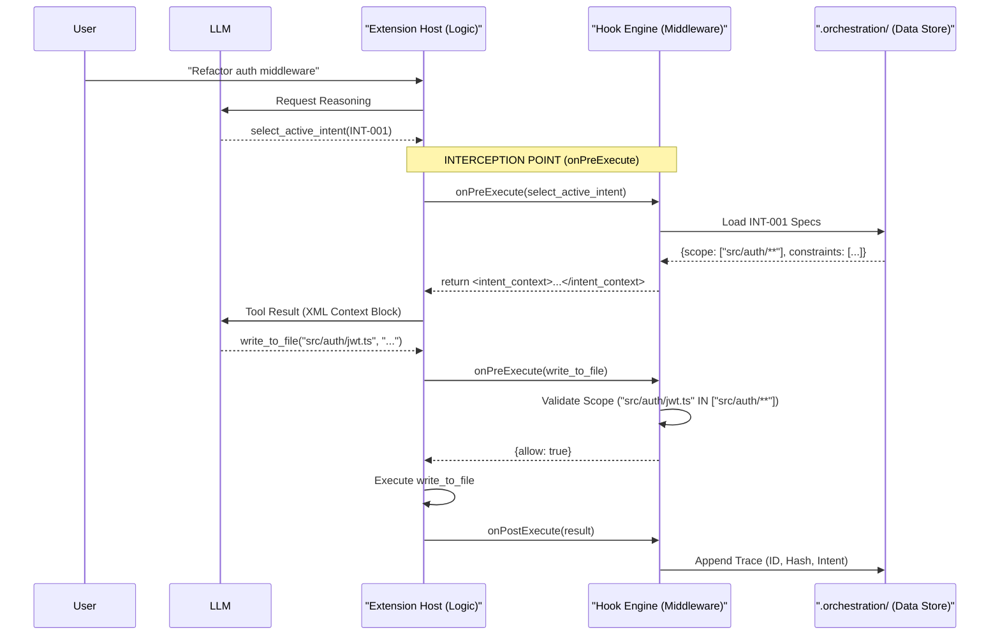
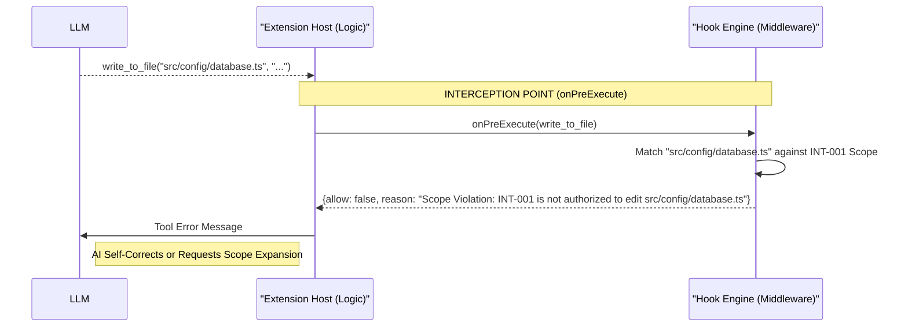

# Project Report: Governed AI-Native IDE Architecture

## 1. Host Extension Architectural Analysis (Phase 0)

### 1.1 Trace of Execution: The Nervous System

The agent turn lifecycle in Roo Code is a recursive loop managed by the `Task` class (`src/core/task/Task.ts`). A single turn follows this exact chronological trace:

1.  **System Prompt Construction**: The `generateSystemPrompt` function in `src/core/webview/generateSystemPrompt.ts` (line 12) orchestrates the assembly of the system instructions. It calls the `SYSTEM_PROMPT` generator in `src/core/prompts/system.ts` (line 42).
    - **Constraint**: The system prompt is stateless and must be re-assembled on every turn to incorporate current mode instructions, MCP tools, and the new **Intent Context**.
2.  **Request/Response Cycle**: `Task.recursivelyMakeClineRequests()` sends the consolidated prompt to the LLM.
3.  **Tool Call Parsing**: As the LLM streams the response, the `NativeToolCallParser` (`src/core/assistant-message/NativeToolCallParser.ts`) extracts tool invocations from the JSON chunks (lines 250, 294).
4.  **Message Processing**: `presentAssistantMessage.ts` (line 64) handles the resulting content blocks. It is here that the **Hook Engine** intercepts execution.

### 1.2 Data Boundaries: Webview vs. Extension Host

The system enforces a strict privilege separation between layers:

- **Webview (React)**: The presentation layer. It communicates with the logic layer exclusively via `postMessage` IPC, handled by `webviewMessageHandler.ts` (line 89). It has no access to Node.js APIs or the file system.
- **Extension Host (Node.js)**: The logic layer where the `Task` orchestrator resides (`src/core/task/Task.ts`, line 108). All file I/O, API calls, and tool executions happen here.
- **Data Transformation**: Input from the Webview (JSON) is validated and transformed into internal `ClineMessage` objects before being passed to the `Task` logic.

### 1.3 Identification of Injection Points

The exact logical chokepoint for the hook system is within `src/core/assistant-message/presentAssistantMessage.ts`. Specifically:

- **Pre-Hook Injection**: Immediately before tool execution (line 716), `hookEngine.onPreExecute` is called to validate the intent and scope.
- **Post-Hook Injection**: Immediately after tool execution (lines 186, 515), `hookEngine.onPostExecute` is called to log the trace and update the spatial map.

---

## 2. The 'Reasoning Loop' Architecture (Phases 1 & 2)

### 2.1 The Handshake Mechanism (Two-Stage State Machine)

To solve the **Context-Injection Paradox**, we implemented a **Two-Stage State Machine**. The agent is programmatically restricted from performing mutating actions (write, execute) until it has established context.

1.  **Stage 1 (Intent Selection)**: The agent calls the `select_active_intent` tool.
2.  **Stage 2 (Interception & Injection)**: The `HookEngine` intercepts this call, reads the corresponding intent from `.orchestration/active_intents.json`, and injects the XML `<intent_context>` block directly into the tool result.
3.  **State Transition**: Only after this handshake is the `activeIntentId` set on the `Task` state, allowing subsequent tool calls to pass the `onPreExecute` gatekeeper.

### 2.2 The Trigger Mechanism & Gatekeeper

- **Trigger Tool**: `select_active_intent` is the formal signal. If any mutating tool is called while `activeIntentId` is null, the Hook Engine returns an error: _"You MUST call select_active_intent first."_
- **Gatekeeper Logic**: The Gatekeeper logic uses `minimatch` to compare the target file path in a `write_to_file` call against the `owned_scope` defined in the intent specification.
- **Scope Enforcement**: If the model attempts to write outside its authorized scope, the hook returns a blocking error: _"Scope Violation: REQ-001 is not authorized to edit [filename]. Request scope expansion."_
- **Locked Status**: If an intent's status is not `IN_PROGRESS`, the gatekeeper blocks modifications, preserving the integrity of finished or archived work.

### 2.3 Theoretical Grounding: Repaying Debt

- **Cognitive Debt**: By forcing the agent to explicitly select an intent, we ensure the LLM's attention is focused on specific sub-tasks, preventing the "vibe coding" drift that occurs in long-running, unconstrained sessions.
- **Trust Debt**: The cryptographic **Agent Trace** (linking Intent ID -> Code Hash) replaces blind acceptance with a verifiable audit trail. We move from "The AI changed the code" to "The AI implemented INT-001 within the authorized scope of src/auth/".

---

## 3. Visual System Blueprint

### 3.1 Sequence of Events: The Governed Reasoning Loop

The following diagram illustrates the chronological flow and the middleware's interruption of the agent turn.

#### [Scenario A: Happy Path - Context Injection]



#### [Scenario B: Guardrail - Scope Violation Rejection]



### 3.2 Component Separation & Data Payloads

The architecture is realized as three distinct entities with clearly defined interfaces:

| Component                 | Responsibility                                                            | Data Payload Examples                                    |
| :------------------------ | :------------------------------------------------------------------------ | :------------------------------------------------------- |
| **Hook Engine**           | Centralized middleware singleton (`HookEngine.ts`). Evaluates invariants. | `{ allow: boolean, reason?: string }`                    |
| **Data Store (Sidecars)** | Machine-managed persistence in `.orchestration/`.                         | `active_intents.json`: `{ id: "INT-001", scope: [...] }` |
| **Host Logic**            | The orchestrator (`Task.ts`) and message processor.                       | `Intent Context`: `<intent_context>...</intent_context>` |

**Trace Record Payload (Audit Logic):**

```json
{
	"id": "uuid-v7-generated-id",
	"timestamp": "2026-02-18T22:45:00Z",
	"vcs": { "revision_id": "8a7f4e2..." },
	"files": [
		{
			"relative_path": "src/auth/jwt.ts",
			"ranges": [
				{
					"start_line": 1,
					"end_line": 50,
					"content_hash": "sha256:e3b0c442..."
				}
			],
			"related": [{ "type": "specification", "value": "INT-001" }]
		}
	]
}
```
